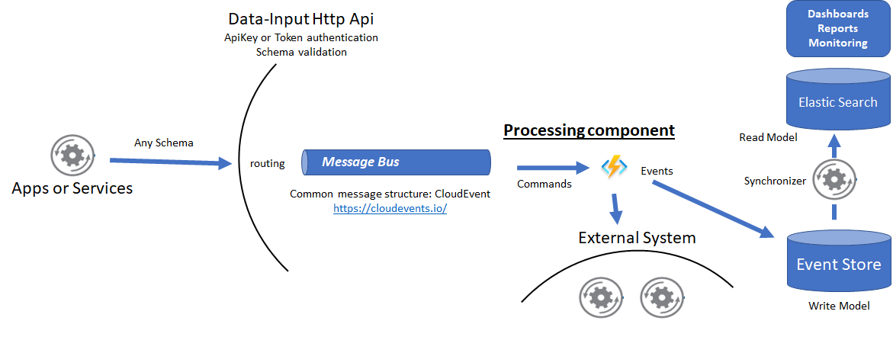

# Introduction 
This C# .Net WebApi solution is for exposing a single endpoint able to receive any message from any configured tenant conforming the CloudEvent schema. Messages are validated and sent to an internal message bus.   
  

  
The solution is formed by the following project types:
1. Api: the project with the running Api program and some implemented services 
2. MessageBus: the project with the implemented IMessageSender interface. 
2. Api.Contracts: where all the service contracts are defined 
3. Api.Model: contains the entity representing a tenant 